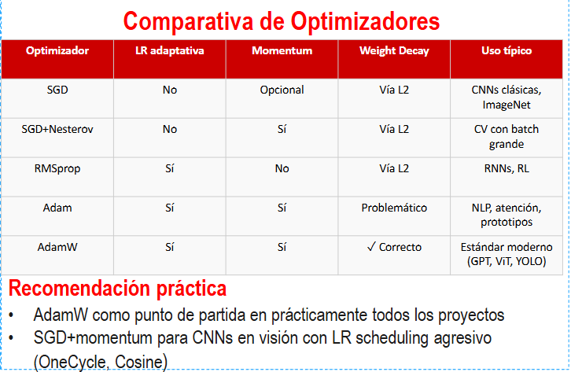

Clase 3 (Unidad 2 - Diapositiva 76 a 118)

# Backpropagation
<note>
Una red mas profunda y estrecha suele generalizar mejor que una red mas ancha y shallow
</note>

<note>
El mismo número de parámetros distribuido en más capas → 
mejorperformance
</note>

Objetivo: Actualizar los parámetros de una red para reducir la función de pérdida $J$.

$$\theta = \theta - \eta \frac{\partial J}{\partial \theta}$$

## ¿Cómo calcular $\partial J / \partial \theta$ para cadacapa?
-  La pérdida $J$ depende de la salida, que depende de la última capa
-  La última capa depende de la penúltima, y así sucesivamente
-  Aplicación de la regla de la cadena al grafo computacional de una red 
neuronal para propagar la señal de error desde la salida hacia los 
pesos de las primeras capas
- Complegidad $O(|\theta|)$ 

**Operaciones**
- Forward pass: calcular y guardar las activaciones de cada capa
- Backward pass: propagar gradientes desde la salida hacia la entrada

## Backpropagation vectorizada
$H^l \in \mathbb{R}^{N \times H_l}$ - Activaciones de la capa $l$

$W^l \in \mathbb{R}^{H_l \times H_{l-1}}$ - Pesos de la capa $l$

$\delta^{l} \equiv \frac{\partial J}{\partial z^{l}} \in \mathbb{R}^{N \times H_l}$ - Gradientes de perdida respecto a las preactivaciones

## Forward pass - guardar activaciones
Entrada (capa 0) $H^0 = X$

Preactivacion de la capa $l$: $Z^l = H^{l-1} W^{lT} + b^l$

Activacion de la capa $l$: $H^l = f(Z^l)$

## Backward pass - propagar gradientes

Propagación del error hacia la capa anterior ($\odot$ = Hadamard):
$$\delta^{l} = \delta^{l+1} W^{l+1} \odot f'(Z^l)$$

Gradiente de la pérdida respecto a los pesos $W^l$:
$$\frac{\partial J}{\partial W^l} = H^{l-1} \delta^lT$$

Gradiente de la pérdida respecto a los sesgos $b^l$:
$$\frac{\partial J}{\partial b^l} = \sum_{n} \delta^l_n$$

Gradiente respecto a las activaciones de la capa anterior:
$$\frac{\partial J}{\partial H^{l-1}} = \delta^l W^l$$

Aplicar derivada de la activación para obtener $\delta^l$:
$$\delta^l =  \left( \delta^{l+1} W^{l+1} \right) \odot f'(Z^l)$$

## Algoritmo de backpropagation vectorizado

Actualización de pesos $W^l \leftarrow W^l - \eta \frac{\partial J}{\partial W^l}$

Actualización de sesgos $b^l \leftarrow b^l - \eta \frac{\partial J}{\partial b^l}$

# Regularización

## Early Stopping
Detener el entrenamiendo cuando la pérdida de validación deje de mejorar

## L2 Regularization (Weight Decay)

Función de pérdida con regularización L2:
$$L_{reg} = L + \frac{\lambda}{2} \sum_{l} \| W^l \|^2$$

**Gradiente**
$$\frac{\partial L_{reg}}{\partial W^l} = \frac{\partial L}{\partial W^l} + \lambda W^l$$

**Actualización**
$$W^l \leftarrow (1 - \eta \lambda) W^l - \eta \frac{\partial L}{\partial W^l}$$

**Interpretación**
- Penaliza pesos grandes, los fuerza a ser pequeños
- Promueve soluciones suaves y generalizables

## L1 Regularization (Sparsity)
Función de pérdida con regularización L1:
$$L_{reg} = L + \lambda \sum_{i,j} | W^l_{ij} |$$

**Gradiente**
$$\frac{\partial L_{reg}}{\partial W^l_{ij}} = \frac{\partial L}{\partial W^l_{ij}} + \lambda \cdot sign(W^l_{ij})$$

$sign(x) = \frac{\partial}{\partial x} |x|$

**Propiedad de sparsity**
- L1 empuja los pesos a exactamente cero, soluciones sparse
- L2 reduce los pesos pero rara vez a cero, soluciones densas

<note>
L2 es estándar en casi todos los modelos modernos, L1 se usa menos en DL profundo, es mas común en modelos lineales
</note>

## Dropout
- Durante el entrenamiento: cada neurona se "apaga" con probabilidad $p$ independientemente.
- Las neuronas activas se escalan por $1/(1-p)$ para mantener la magnitud de las activaciones.
- Durante la evaluación: todas las neuronas están activas, no hay dropout.

**Efecto de Dropout**
- Es un pseudo ensamble: es como entrenar simultaneamente $2^H$ subredes diferentes, promedia sus predicciones durante la evaluación.
- Añade ruido a las activaciones que previene la co-adaptación de neuronas
- Robustez: la red aprende a no depender de neuronas específicas

## Batch Normalization

**Resuelve el problema de internal covariate shift**
- La distribución de las activaciones de cada capa cambia durante el entrenamiento
- Las capas posteriories deben adaptarse constantemente a estas nuevas distribuciones
- Esto frena el entrenamiento y requiere $\eta$ muy pequeño

**Beneficios**
- Permite usar $\eta$ más grande
- Regularización impícita: reduce la necesidad de dropout
- Reduce la dependencia de la inicialización de pesos

**Antes o después de la activación?**
- Original: BatchNorm después de la activación
- Pre Norm: BatchNorm antes de cada bloque, activación después

### Algoritmo
Media del mini batch:
$$\mu_B = \frac{1}{N} \sum_{n} Z_n$$

Varianza del mini batch:
$$\sigma_B^2 = \frac{1}{N} \sum_{n} (Z_n - \mu_B)^2$$

Normalización:
$$\hat{Z}_n = \frac{Z_n - \mu_B}{\sqrt{\sigma_B^2 + \epsilon}}$$

Escalado y desplazamiento:
$$y_n = \gamma \cdot \hat{Z}_n + \beta$$

### Detalles importantes
- Durante el entrenamiento se usan $\mu_B$ y $\sigma_B^2$ del mini batch y se actualizan promedios y desvíos móviles
- Durante la evaluación se usan los móviles.
- $\gamma$ y $\beta$ permiten que la red revierta la normalización si es necesario

### Limitaciones
- Depende del tamaño del batch. Batch pequeños → estimaciones ruidosas de $\mu_B$ y $\sigma_B^2$ 
- Con batch_size=1 es totalmente inestable
- Alternativas: LayerNorm

## Layer Normalization

**Diferencia con BatchNorm**
- BatchNorm normaliza a través del mini batch, calculando $\mu_B$ y $\sigma_B^2$ sobre las N muestras
- LayerNorm normaliza a través de las características, calculando $\mu_L$ y $\sigma_L^2$ para cada muestra

**Ventajas sobre BatchNorm**
- No depende del tamaño del batch, funciona bien con batch_size=1
- Idéntico durante entrenamiento y evaluación - sin modo dual
- Estándar en todos los Transformers y modelos de NLP

### ¿Cuándo usar BatchNorm vs LayerNorm?
- BatchNorm: CNNs, MLPs con batch grande, CV
- LayerNorm: RNNs, Transformers, NLP, batch variable

### Algoritmo
Media por muestra:
$$\mu_n = \frac{1}{H} \sum_{h} Z_{n,h}$$
Varianza por muestra:
$$\sigma_n^2 = \frac{1}{H} \sum_{h} (Z_{n,h} - \mu_n)^2$$
Normalización:
$$\hat{Z}_{n,h} = \frac{Z_{n,h} - \mu_n}{\sqrt{\sigma_n^2 + \epsilon}}$$
Escalado y desplazamiento:
$$y_{n,h} = \gamma \cdot \hat{Z}_{n,h} + \beta_h$$

## Gradient descent

**Problemas:**
- SGD muy sensible al $\eta$
- Mismo learning rate para todos los parámetros
- oscila en valles alargados
- Saddle points: más comunes que minimos locales en alta dimensión
- Ravines(curvatura alta en una dirección, baja en otra) → zigzag lento
- Plateaus(gradiente cercano a cero)

**Soluciones:**
- Momentum: acumular historia de gradientes para suavizar trayectoria
- Adaptive learning rates: ajustar $\eta$ por parámetro según su historial

### Algoritmo SGD con Momentum

Velocidad - media exponencial móvil del gradiente:
$$v_t = \underbrace{\Beta}_{\text{coeficiente\\de momentum}} \cdot v_{t-1} + (1 - \Beta) \cdot g_t$$

Actualización con momentum:
$$\theta_{t+1} = \theta_t - \eta \cdot v_t$$

**Intuición física:**
- En direcciones consistentes: velocidad aumenta, convergencia más rápida
- En direcciones oscilantes: la velocidad se cancela, reducción del zigzag

## RMSprop - Adaptive learning rates

Media exponencial móvil del cuadrado del gradiente($\rho\approx 0.9$):
$$s_t = \rho \cdot s_{t-1} + (1 - \rho) \cdot g_t^2$$

Actualización con RMSprop:
$$\theta_{t+1} = \theta_t - \frac{\eta}{\sqrt{s_t + \epsilon}} \cdot g_t$$

**Efecto:** LR grande para parametros con gradientes pequeños y viceversa

**Cuando usar**: RNNs. En la practica `Adam` combina momentum + RMSprop

## Adam - Adaptive Moment Estimation
Primer momento - media exponencial de gradientes ($\Beta_1 \approx 0.9$):
$$m_t = \Beta_1 \cdot m_{t-1} + (1 - \Beta_1) \cdot g_t$$

Segundo momento - media exponencial del cuadrado de gradientes ($\Beta_2 \approx 0.999$):
$$v_t = \Beta_2 \cdot v_{t-1} + (1 - \Beta_2) \cdot g_t^2$$

Correción de bias - primer moment(importante al inicio del entrenamiento):
$$\hat{m}_t = \frac{m_t}{1-\Beta_1^t}$$

Corrección de bias - segundo momento:
$$\hat{v}_t = \frac{v_t}{1-\Beta_2^t}$$

Actualización adam ($\eta=10^{-3}\wedge\epsilon = 10^{-8}$):
$$\theta_{t+1} = \theta_t - \frac{\eta\cdot\hat{m}}{\sqrt{\hat{v}_t} + \epsilon}$$

**Intuición**
- $\hat{m}_t$  dirección suavizada del decenso
- $\sqrt{\hat{v}_t}$  escala adaptativa. parámetros con gradientes grandes tienen LR efectiva menor.

## AdamW

**Problema con Adam+L2**
- Añadir $\lambda \|W^l\|^2$ a la función de pérdida e incluirlo en g_t no equivale a weight decay puro
- El L2 en adam queda amortiguado por $\sqrt{\hat{v}_t}$, diferentes parametros reciben diferentes decays.

**Solución**
- Separar el weight decay de la actualización de Adam
- Actualización AdamW: - el weight decay actúa directamente sobre $\theta$ $$\theta_{t+1} = \theta_t - \frac{\eta \cdot\hat{m}_t}{\sqrt{\hat{v}_t} + \epsilon} - \eta \lambda \theta_t$$

**Impacto practico**: Generaliza mejor y es adoptado como estandar en modelos modernos

#  Learning Rate Scheduling

Modificar el learning rate en el tiempo
- Step decay: reducir $\eta$ por un factor cada N epochs
- Cosine Annealing: LR sigue un coseno de $\eta_{max}$ a $\eta_{min}$
- OneCycleLR: aumentar hasta $\eta_{max}$ y luego disminuir a $\eta_{min}$
- Warmup lineal: LR crece de 0 a $\eta_{max}$ en los primeros N pasos
- ReduceLROnPlateau: reducir $\eta$ cuando la métrica de validación deje de mejorar
- Warmup + Cosine decay(estandar en transformers y ViT): crece en determinados steps y luego coseno. evita inestabilidad cuando los pesos son todavía aleatorios al principio.

**Problemas de no hacerlo**
- Pesos demasiados grandes → gradientes explosivos
- Pesos demasiado pequeños → gradientes desvanecidos
- Redes de 10+ capas con pesos aleatorios: training imposible sin BN

**Objetivo**: Mantener la varianza de las acvtivaciones constante a través de las capas, y la de los gradientes durante la backpropagation. 

## Inicialización He/Kaiming

Varianza He: - compensar el factor 1/2 de ReLU 
$$Var(w) = \frac{2}{D_{in}}$$

Distribución uniforme He:
$$w \sim Uniform\left(-\sqrt{\frac{6}{D_{in}}}, \sqrt{\frac{6}{D_{in}}}\right)$$

Distribución normal He:
$$w \sim \mathcal{N}\left(0, \frac{2}{D_{in}}\right)$$

## Gradient Flow
Monitorear el flujo de gradientes es critico para detectar problemas de entrenamiento como gradientes explosivos o desvanecidos.
**Que monitoriar?**
- Norma de los gradientes por capa: $||\frac{\partial J}{\partial W^l}||$
- Histograma de los gradientes: distribución de valores de $\frac{\partial J}{\partial W^l}$
- Ratio gradiente/peso: $||\frac{\partial J}{\partial W^l}|| / ||W^l||$

**Señales de vanishing gradients**
- Norma de gradientes decrece exponencialmente hacia capas anteriores
- La perdida no disminuye aunque el modelo tenga capacidad suficiente
- Los pesos de las primeras capas no se actualizan significativamente

**Señales de exploding gradients**
- La perdida diverge (NaN o infinito)
- Los pesos crecen sin control
- Solucion: clipping de gradientes: $ g \leftarrow g \cdot \min\left(1, \frac{\text{max\_norm}}{||g_t||}\right)$

*Herramienta W&B: gradientes en tiempo real*

# Sanity checks
1. Perdida inicial correcta: verificar que la perdida inicial es razonable (ej. con softmax es esperado $\log(C)$ para C clases)
2. Overfit en un batch pequeño: el modelo debería poder alcanzar 100% de accuracy en un batch de 5-20 muestras.
3. Verificar shapes: asegurarse que las dimensiones de activaciones, pesos y gradientes son correctas
4. gradient chack numerico: torch.autograd.gradcheck para verificar que los gradientes calculados por backprop son correctos
5. Monitorear la primera epoca: verificar que la perdida disminuye monotonamente

## Diagnostico:
- La perdida no disminuye:
    - Learning rate bajo → aumentar 10x
    - Gradientes vanishing → revisar inicialización y funciones de activación
    - Bug en la perdida → revisar con batch pequeño
- La perdida diverge o NaN:
    - Learning rate alto → reducir 10x
    - Gradientes explosivos → implementar clipping de gradientes(max_norm=1.0)
    - Overflow en exp() → usar log-sum-exp trick en softmax
- Overfitting:
    - Aumentar regularización (weight decay, dropout)
    - Data augmentation
- Underfitting:
    - Aumentar capacidad del modelo (más capas, más neuronas)
    - Reducir regularización
- Entrenamiento Lento:
    - Verificar uso de GPU
    - Aumentar Batch size
  