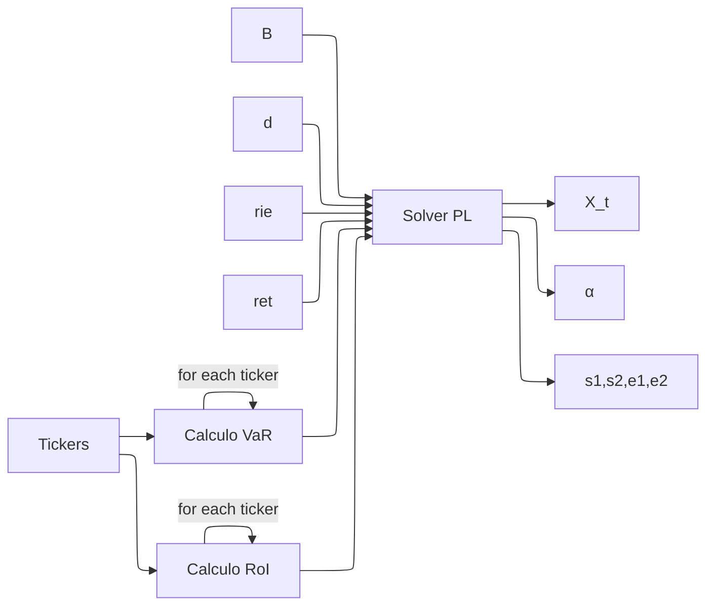

# Preparación respuestas para el final

## Defensa del TP

### 1. En no más de dos parrafos describa el problema de negocio seleccionado para el TAF (logística, staffing, cartera, etc.) e identifiquen al usuario final de la herramienta desarrollada.

En mi caso, se seleccionó el problema del portafolio de markowitz. El problema toma una serie de activos financieros , cada uno con un nivel de riesgo y retorno esperados, y determina la cartera de inversiones óptima para invertir con un determinado nivel riesgo y retorno deseados.

El usuario final para el que la herramienta esta diseñada es un inversionista común, sin importar su presupuesto. Tiene por objetivo orientar a este en la toma de decisiones sobre como distribuir su dinero para realizar la mejor inversión posible.

### 2. En un parrafo explique las conclusiones obtenidas. ¿Cual fue el valor agregado real de la optimización respecto a una solución manual o heurística?

Al contrario de una solución manual o heurística, el modelo de optimización permite encontrar una solución mucho mas precisa y más rápida al problema de la selección de portafolio óptimo. Además, el modelo puede adaptarse fácilmente a diferentes escenarios y parámetros mas complejos de los que se podrían evaluar de forma manual (en un tiempo razonable), permitiendo al usuario explorar distintas opciones de inversión y sus consecuencias en términos de riesgo y retorno esperado.

### 3. Describa la naturaleza de los datos de entradas (inputs). ¿Cómo evitó el "hardcoding" y que formato de ingesta de datos utilizó (CSV, API, etc.)?

La entrada del modelo se diseñó a travez de una interfaz web donde se introducen los parametros del modelo en campos de texto de un formulario.

### 4. Explique el proceso de validación. ¿Cómo verificaron que la solución matemática fuese factible en la realidad operativa?

### 5. Enumere las 3 principales dificultades encontradas, ya sea en el modelado matemático o en la implementación del prototipo en Python.

1. definición de la función objetivo: definir la función como $e_1 + e_2 + s_1 + s_2$ no daba los resultados esperados ya que 
2. Implementación de la interfaz web: al ser mi primer proyecto con Flask, tuve que aprender a manejar la librería y entender como conectar el modelo de optimización con la interfaz.
3. Análisis de sensibilidad: interpretar los resultados del análisis de sensibilidad y entender como afectan a la solución del modelo no fue trivial al principio.

## Elementos detallados del modelo y deployment

### Formulación matemática (Modelo conceptual):
- **Objetivo general: ¿Que se busca optimizar? (Max/Min)**

En este caso se busca encontrar el mejor balance posible entre riesgo y retorno esperado maximizando el retorno esperado y minimizando el riesgo, tratando de mantener ambos dentro de los limites deseados por el usuario.

- **Función objetivo: Expresión matemática de Z**

$$Z=\underbrace{\sum_{t \in T} X_t \cdot RoI_t}_{(1)} - \underbrace{\sum_{t \in T} X_t \cdot VaR_t}_{(2)} - \underbrace{B\cdot(\Delta s_1 + (1-\Delta) s_2)}_{(3)}$$

(1) Representa el retorno esperado total de la cartera que se quiere maximizar

(2) Representa el riesgo total de la cartera que se quiere minimizar

(3) Representa la penalización por incumplimiento de las restricciones de riesgo y retorno que se queieren minimizar
- **Variables de decisión: Definición, tipo (Continuas, Enteras, Binarias) y que representan en la realidad**

$X_t$: Monto invertido en el activo t (Continuas)

$\alpha_t$: Variable binaria que indica si se invierte en el activo t (Binarias)

$s_1, s_2$: Variables de holgura para las restricciones de riesgo y retorno (Continuas)

$e_1, e_2$: Variables de exceso para las restricciones de riesgo y retorno (Continuas)

### Restricciones y lógica de negocio:
**nomenclatura(parametros):**

$T$: conjunto de activos

$B$: presupuesto total disponible

$VaR_t$: valor en riesgo del activo t

$RoI_t$: retorno esperado del activo t

$ret$: retorno esperado total deseado

$rie$: riesgo total deseado

- **Restricciones "duras" (Hard constraints): Ecuaciones clave que limitan la región factible (ej. capacidad, balance)**

Restricción presupuestaria:
$$\sum_{t \in T} X_t \leq B$$

Restricción de riesgo:
$$\sum_{t \in T} X_t \cdot VaR_t - s_1 + e_1 \leq ts \cdot ret$$

Restricción de retorno:
$$\sum_{t \in T} X_t \cdot RoI_t + s_2 - e_2 \leq ts \cdot rie$$

Restricción de diversificación:
$$\sum_{t \in T} \alpha_t \leq |T|$$

Vinculación diversificación-activo:
$$\sum_{t \in T} X_t \leq \alpha \cdot B$$

- **Manejo de Infactibilidad: ¿Cómo responde el modelo si no existe solución posible con los recursos dados?**

### Analisis de sensibilidad y robustez:
- **Análisis post-óptimo: Interpretación de precios sombra (duales) o análisis de rangos si aplica**
- **Escenarios: ¿Que parámetros clave variaron para probar la robustez?**

Para este  caso, los valores que se variaron fueron principlamente los parametros de riesgo y retorno esperados, para observar como se comportaba la solución del modelo ante diferentes niveles de exigencia en estos aspectos. El presupuesto no tiene ningun tipo de impacto ya que solo determina volumnen de inversión y no la composición de la cartera. La cantidad de dias a los que se plantea la inversión puede tener un impacto mayor o menor dependiendo de los activos.

**Arquitectura del prototipo (deployment):**
- **Stack tecnológico: librería de modelado utilizada (pyomo, pulp.+, or-tools) y solver seleccionado (CBC,gurobi,GLPK)**

Para este caso se utilizó la librería PuLP junto con el solver CBC para resolver el modelo de programación lineal.

- **Interfaz de usuario: Tipo de implementación (Streamlit, API, Notebook Interactivo)**

Como interfaz de usuario se implementó una aplicación web utilizando Flask, donde se pueden ingresar los parámetros del modelo a través de un formulario, y luego se muestra la solución obtenida, los niveles de inversión en cada activo y los valores de riesgo y retorno esperados, además de recomendaciones para el usuario basadas en el análisis de sensibilidad.

- **Flujo de la solución: Input $\rightarrow$ Solver $\rightarrow$ Output accionable que les correspondería** 

