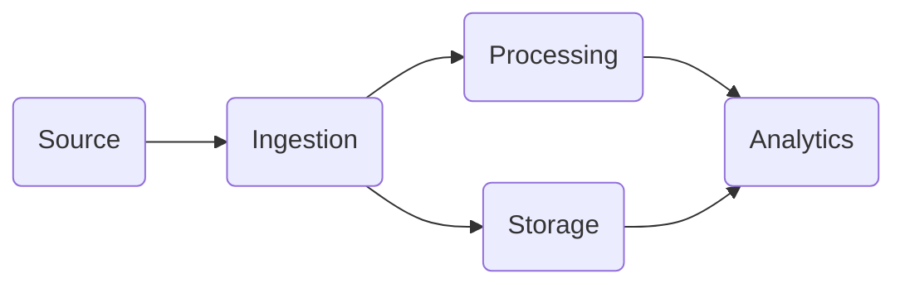
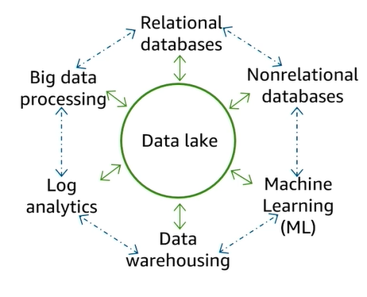
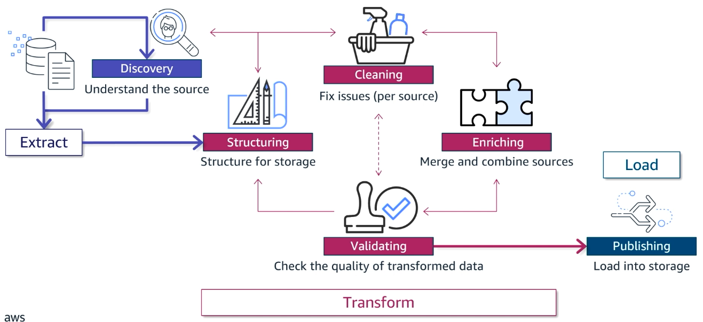

  Ingeniería de datos

  Práctica

comment for the copilot: this is a summary of the data engineering course from aws 

# Data driven organizations

## Data driven decisions
**Techniques:**
- Data analytics: Analyze datasets to find patterns and trends in structured data
- AI: Mathematical models that use examples of unstructured data to make predictions

More valuable insights are more difficult to derive
$$\text{descriptive}>\text{diagnostic}>\text{predictive}>\text{prescriptive}$$

More data $+$ Fewer barriers $=$ More opportunity for data driven decisions

Data becomes less valuable over time. High value data if you can analyze it real time.

## The data pipeline – infrastructure for data-driven decisions

| data | $\Rightarrow$ | insights |
|------|---------------|----------|
| collect|store and process | insights|

Building a data pipeline is an iterative process. You start with a hypothesis:"this data will answer the business need" and see where it takes you and if you need to improve/expand it.

## The role of the data engineer in data-driven organizations
|           |Engineer                        | Scientist                     |  
|-----------|--------------------------------|-------------------------------|
| Main role | Getting data into the pipeline | Getting value out of the data |
| Focus     | Infrastructure                 | Data in the pipeline          |

## Modern data strategies
- Modernize: Move to cloud, Purpose-Built tools, independent components
  - more agility, less hardware setup
- Unify: silos to datalake, democratize access, visualization tools for users, data governance
  - single source of truth
- Innovate: Proactive decision-making, incorporate AI
  - use ai to get new insights

# The elements of data

## The 5 Vs of data

- Velocity: How frequently data is generated? 
- Variety: How many sources and formats?
- Veracity: How accurate and trusted is the data?
- Value: What insights can be pulled?
- Volume: How much data is generated?
  
**how to get value?**
- confirm the need can be met
- evaluate if data can be acquired
- match design to data
- ROI (balance throughput and cost)
- Users focus on business
- Catalog and governance
  
## Volume and velocity

**Volume and velocity touch every part of the pipeline:**
- Ingestion: Scale pipelines to handle the volume at the pace of its arrival
- Storage: How long data should be stored
- Processing: How much data should be processed and how quickly to address a business problem
- Visualization: How much data users need and how frequently it should be updated

## Variety

**Data types:**
- Structured: (SQL database)
    - well defined schema. Easy to query. Not flexible. Hot(ready to analyze)
- Semi-structured: (JSON, XML, Parquet, CSV)
    - Some schema. Easy to query. Flexible.
- Unstructured: (Text, images, audio, video)
    - No schema. Hard to query. Flexible.

**Data sources:**
- On premises databases: Controlled by organization, structured data, sensitive
- Public datasets: Unnecessary, semistructured, transformation and joins required
- IoT devices: Streaming, realtime ingestion and processing

## Veracity and value

Bad data < Limited data < Good data

**Veracity in the pipeline:**
- Source: discover validity
    - Deleted information, Missing, Lack of lineage, Inconsistent, Bias
- Ingestion: Clean data
    - Duplicates, anomalies
- Storage: Prevent unwanted changes. Assure consistency
    - software bugs, human error, tampering
- Processing and analysis: Preserve data quality

**Best practices**
- Cleaning: Define clean, Trace errors, Don't make assumptions, Retain auditable data 
- Ingestion: Make data formats match across sources
- Storage: Don't save aggregated data. (traceability,flexibility,auditing)
- Transformation: 

# Design Principles and Patterns for Data Pipelines

## AWS Well-Architected Framework and Lenses
**Pillars**
- Operational excellence
- Security
- Reliability
- Performance efficiency
- Cost optimization
- Sustainability

## The evolution of data architectures
Server: Mainframe -> Client-Server -> Internet 3-Tier -> Cloud based microservices

Storage: SQL Database -> NoSQL Database -> DataLake -> Purpose-Built Store

Processing: OLAP vs OLTP -> Big Data -> Lambda architecture and streaming

## Modern data architecture on AWS

- Store data in a centralized location available for all consumers
- One source of truth (data lake) and multiple SORs
  - Seamless data movement
  - Scalable data lake
  - Unified governance

  

## Modern data architecture pipeline

### Ingestion and storage
**Ingestion**
- Purpose built AWS services to match source types connectivity and velocity

**Storage**
- Storage (S3, Redshift)
- Catalog (Lake Formation, AWS Glue Data Catalog)

### Processing and consumption
**Processing**
- Transform data into a consumable state (redshift -> sql, glue & emr -> big data, kinesys -> stream)
- Each component reads and writes to storage

**Consumption**
- Sagemaker AI, Quicksight BI, Athena SQL

## Streaming analytics pipeline
- Ingestion and producers: CloudWatch
- Stream storage: Kinesis Streams
- Stream processing: Kinesis Analytics
- Visualization: Opensearch
- Downstream: S3, Redshift

# Securing and Scaling the Data Pipeline

## Cloud security review
**Shared responsibility model:**
- AWS: Hardware, Software, Networks, Facilities
- Consumer: Applications connected to AWS, Implementations

**Principles:**
- Strong identity foundation (IAM)
- Traceability
- All layers
- Automate security
- Protect data
- Keep people away from data
- Prepare for security events

**AWS IAM**
- Access policies for users and groups
- Granular permissions
- Information assurance with logs

**AWS KMS**
- cryptographic keys
- usage policies for users

**Logging**: Collection of event metadata

**Monitoring**: Verification of security and performance
- Cloudwatch: logging, governance, auditing and compliance

## Security of analytics workloads
**Classify and protect data**
- Understand data classifications and policies
- Identify source data owners
- Record data classifications into catalog
- Implement data encryption
- Implement data retention policies

**Control data access**
- Allow data owners to determine access
- Build user identity solutions
- Implement data access authorization models
- Emergency access policies

**Control the access to workloads infrastructure**
- Prevent unintended access
- Least privilege
- Monitor infrastructure changes and user activity
- Secure infrastructure audit logs

## ML security

**Protect data across the ML Lifecycle**
- Identify business goal
  - Validate privacy of ML software and libraries
- Frame the ML problem
  - Least privilege
- Collect, Preprocess, FE
  - Secure modeling environment 
  - Protect PII (encryption, access)
  - Data lineage
  - Keep only relevant data
- Training and evaluation
  - Centrally managed notebook
  - Prevent data injections
  - Detect anomalies
- Deployment
  - Protect against malicious activities
- Monitoring
  - Monitor human interaction
  - Restrict access to the model

## Scaling: An overview 

|Horizontal | Vertical|
|-|-|
| add more nodes or computers| add more resources to each computer (e.g. RAM)|

**AWS Auto Scaling:** automatic, predictive scaling for  workloads, with scaling plans and continuous performance monitoring (CloudWatch)

**Scaling and cost management**
- Identify performance goals
- Allow components to scale individually
- Use metrics to find bottlenecks 

## Creating a scalable infrastructure

**Infrastructure as Code (IaC)**
- Automatic infrastructure changes declaratively or programmatically
- Reliability and rigor

|Declarative (what)| Imperative (what and how)|
|-|-|
|Defines resources and configurations|Defines step by step instructions|
|Defines system state| Focuses on the desired end state|

**AWS CloudFormation**
- Changes resources in stacks(set of resources)
- Automates resource management and provisioning

# Ingesting and Preparing Data

## ETL and ELT comparison
ETL: Source -> match destination -> load
- Better for structured data
- Filter sensitive data and not store it
- Stored data is ready for analysis => faster complex queries

ELT: Source -> data lake -> Transform for analytics
- For structured or unstructured data
- Faster ingestion
- Ad hoc analysis
- Transformations apply historically  

## Data wrangling introduction
**Data wrangling:** Transforming large amounts of raw data from different sources and schemas into a meaningful set of data.

  

## Data discovery
Iterative process

Find sources, query and analyze to see if they have value for the business.
$$value > effort$$

identify: formats, desired range, relationships, access policies

## Data structuring
- Organize storage and partitions
- Parse source files 
- Match/map source to target fields
- Split merge or compress files

## Data cleaning
Is done per source based on the characteristics of the source

- Remove unwanted values, columns, duplicates
- Fill missing data
- Validate types
- Identify and fix outliers

## Data enriching
Merge/Combine data from different SORs

- Merge: Combine clean data from different sources into a dataset 
- Suplement: Add public data to own data
- Aggregations: min, max, avg

## Data validating
Check that data has the veracity i need
- Audit: consistency, metadata, pii
- Fixing: adress audit findings

The data engineer might focus on tasks that validate the accuracy of any automated structuring, cleaning, or enriching activities. 

Validating tasks might overlap with cleaning tasks

## Data publishing
make the dataset available for use within the pipeline
- move data to permanent storage
- make data aviable to consumers

During publishing, you apply your structuring decisions. You need to write data to the appropriate folders or partitions, and apply the file management techniques that you decided on

# Ingesting by Batch or by Stream

## Comparing batch and stream ingestion
- Batch: Batch sized jobs on demand, schedule, event
- Streaming: Continuous, sliding window processing, real time analysis

## Batch ingestion processing
batch job: schedule or trigger to run a set of elt scripts for a batch use case

Orchestration in key: shared resources, timing

Batch pipelines should contain:

|Ease of use |Data volume and variety|Orchestration and monitoring|Scaling and cost management|
|------------|-----------------------|----------------------------|---------------------------|
| flexible   | volume                | workflow                   | scaling                   |
|low/no code | sources and targets   | bookmarking                |pay as you go              |
|serverless  | formats               | logging                    |                           |

## Purpose-built ingestion tools

**Amazon AppFlow(SaaS apps)**
- connector with filters
- map, transform and validate
- transfer to S3 and redshift

**AWS DMS (relational DB)**
- connect to source and format for sink}
- source filters and mappings
- data validation
- write to AWS data store
- Continuous replication task

**AWS DataSync(file systems/file shares)**
- apply filters to transfer a subset of files
- use variety of sources and targets
- secure transfer between self managed storage and AWS

**AWS DataExchange**
- Find and subscribe to sources
- Preview before subscribing
- Copy datasets to S3
- Recieve notifications on updates

## AWS Glue for batch ingestion processing
Integration service for ETL automatic ingestion and transformation and movement

**Automatically generate schema**
- Aws glue crawlers derive schemas from data store and populates data catalog
- AWS S3, redshift, RDS, dynamo DB

**Catalog**

**AWS glue studio for ETL**
- Write scripts and run jobs
- on demand, schedule, event
- pull data
- configure transformation
- set target or sink and view schema

**Serverless processing with spark**
- runtime engine
**orchestrate with workflows**
- multi job and multi crawler
- on demand, schedule, event triggers

**monitor**
- status of jobs
- job bookmarks (checkpoint)
- debugging
- spark ui

## Scaling considerations for batch processing
Batch goals: timing, accuracy, budget (balance and trade-off)

Fix steps:
- bottlenecks
- capacity issue

Take into account
- Size
- Variety
- Transformations

## Services for stream processing

**Amazon kinesis**
- Captures gigabytes of data 
- in parallel, different sources

**Kinesis firehose**
- storage for further use

**Kinesis data analytics**
- transformations

**AWS kinesis producer library(kpl)**
- for creating event capture aplications

**Apache Flink**
- streaming transformations

## Scaling considerations for stream processing
Throughput: make sure record is processed before temp storage expires
- increase temp storage time
- increase compute speed

take into account:
- consumer velocity requirements
- volume

write to stream capacity:
- ammount of shards
- capacity or on-demand

read from stream:
- scale trhoughput
- shared capacity
- enhanced(dedicated) capacity

## Ingesting IoT data by stream
**pub/sub**
$$\text{publishers} \Rightarrow \text{broker}\Rightarrow \text{subscribers}$$

| AWS IoT Core                     | AWS IoT Analytics             |
|----------------------------------|-------------------------------|
| Connect to devices, even offline | simplifies the steps for IoT pipeline for unstructured data|
| Data transformation              | Data transformations               |
| Route data to AWS services       | Time series data store for analysis|

**rules engine**
- applies defined rules to data in a topic
- SQL filter and transform

# Storing and Organizing Data

## Storage in the modern data architecture
Storage is at the centre of the architecture

Types:
**Block:** dedicated, low latency (EBS)
**Object:** all types, scalable,low cost (S3)
**File:** store as file (EFS)

## Data lake storage
Store data *"as is"*

**S3:**
- transform and query data in place
- read at object level
- tiers: intelligent(unknown),standard(frequent),infrequent & onezone(less frequent),glacier (archive)

**LakeFormation**
  - simplifies the processes to create manage and secure DL
  - interoperable with AWS
  - transform data
  - storage optimization
  - governed tables: ACID tables with metadata
  

## Data warehouse storage
**DWH:** 
- Centralized data repository for structured and semistructured.
- frontend + analytics engine + database server (fast + object)
- multiple databases
- data organized in schemas.tables

**AWS Redshift**
- fully managed datawarehouse
- Compute resources(RSHT engine): nodes = leader + workers
  - DC2 low latency high throughput
  - RA3 scalable storage and compute separately
  - DS2 low cost hdd for > 500GB
- Spectrum: can query combining datalake and datawarehouse

## Purpose-built databases

## Storage in support of the pipeline

## Securing storage

# Processing Big Data

# Processing Data for ML

# Analyzing and Visualizing Data

# Automating the Pipeline
