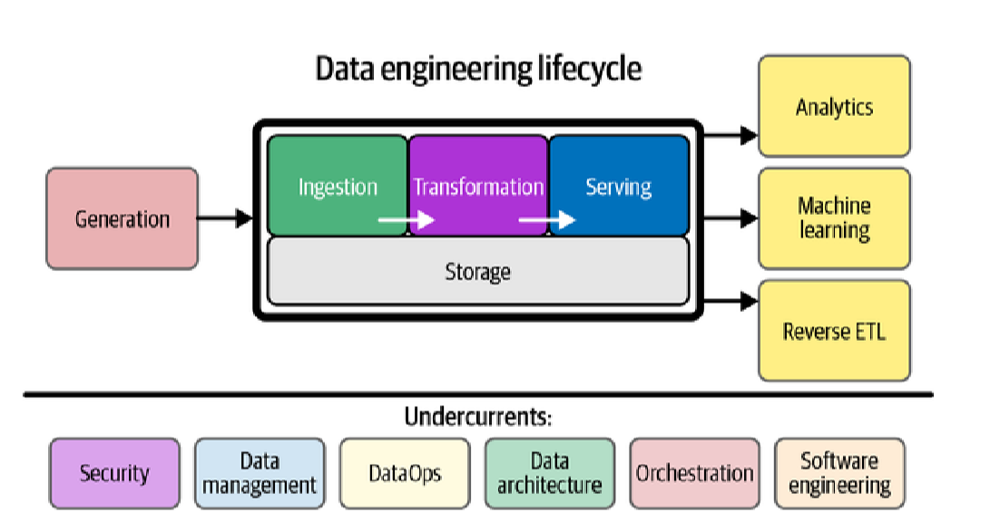

  Ingenieria de datos teoria

# Class 1

**Data engineering:** development, implementation, and maintenance of systems and processes that take in raw data and produce high-quality, consistent information supporting downstream use cases
- sql based: sql etl, databases
- big data based: distributed processing and storage frameworks 
- Type A: tend to focus on using off-the-shelf products, managed services, and tools to manage the data lifecycle.
- Type B: are more involved in building scalable data tools and systems that leverage a company's core competitive advantages
- Internal-Facing: focus on building and maintaining data systems that support internal business needs.
- External-Facing: architect and manage data systems that serve external users or systems, such as customers or third-party applications

**responsibilities**
- business: communication, product requirements, costs, agile.
- technical: sql, python, spark, bash 

**Data maturity models:** progression of an organization’s ability to utilize, manage, and integrate data as a strategic asset. three stages:
- starting with data: no clear goals. beta development architecture. small team.
- scalable and robust architectures. data quality. downstream consumption. team specialization
- automated pipelines. governance. management. new sources. data as a competitive advantage. 

# Class 2

## Data engineering lifecycle
The data engineering lifecycle comprises stages that turn raw data ingredients into a useful end product

    

**data lifecycle**: the entire journey of data—from its creation or capture, through storage, processing, analysis, and eventual disposal.

**data engineering lifecycle** practical steps and practices to facilitate the flow, transformation, storage, and serving of data.

### Generation
Initial phase where data is produced by various origin points or systems. Data engineers need to understand how these systems work—specifically, how they generate and persist data, the frequency and velocity of data production, and the structure or schema of the data.

### Storage
Storage refers to the foundational component of the data engineering lifecycle where data is physically stored for access, processing, and analysis.
- Importance of Storage Selection: affects subsequent steps.
- Complexity of Storage in Cloud Environments: use case tailored solutions
- Multi-functionality of Storage Solutions: storage supports queries and transformations.
- Scalability
- Metadata and governance

**Access frequency:** Hot(nrt logs) > LukeWarm > Cool(large archives)

**Schema support:** storage should support the schema of data. also consider agnostic vs enforced

### Ingestion
Gathering data from source systems into a data pipeline after understanding the data source.
- Use cases
- availability and reliability

**Batch:** large chunks of data at scheduled intervals.

**Streaming:** near-real-time data availability, suitable for use cases requiring immediate insight

**Push:** source systems actively sending data to the target, such as in CDC

**Pull:** ingestion system retrieving data on a schedule or based on specific triggers

### Transformation
Converting ingested and stored raw data into a more useful, structured, and analyzable form
- basic: mapping data types correctly, standardizing formats, and removing invalid or corrupt records.
- advanced: changing data schema, normalizing data to ensure integrity, and aggregations.
- can be batch or real time
- Data transformations are often more intertwined with other lifecycle phases. etl_ts, business logic
- ML feature engineering.

### Serving
Delivering the processed data to users and systems that can generate value from it.

**Analytics:** tprocess of analyzing data to uncover meaningful insights for data driven decision-making.
- Operational Analytics: Focuses on real-time data to monitor ongoing operations 
- Business Intelligence (BI): Analyzes historical data to evaluate past performance and inform future strategies.
- Embedded Analytics: Integrates analytics into other applications, allowing users to access insights within their workflow.

**Machine Learning (ML):** algorithms that can automatically learn patterns and make predictions or decisions based on data
- supervised, unsupervised, reinforcement
- requires quality data: data security, avoiding biases, and maintaining model accuracy and reliability

**Reverse ETL:** taking already processed data and moving it back into operational systems
- It enables organizations to operationalize insights

## Undercurrents

### Security
Protecting data from inappropriate or unauthorized access and ensuring its confidentiality, integrity, and availability.
- appropriate controls
- should be built in from the beginning, not as an afterthought
- encryption, access controls, audit logging in motion and at rest
- compliance
- user, group and role based access policies
- credential management(secrets management tools)
- zero trust networks and vpns

### Data Management
**Data governance:** data management function to ensure quality, integrity, security, and usability.
- Discoverability: They should know where the data comes from, how it relates to other data, and what the data means
- Metadata: 
  - autogenerated or manually created
  - types: bussiness, technical, operational, reference
  - prone to error

**Data accountability:** assigning someone the responsibility to ensure the quality and integrity of a specific portion of data.

**Data quality:** generates trust. veracity. accuracy. schema.

**Data modeling:** converting data into a usable form

**Data lineage:** Describes the recording of an audit trail of data through its lifecycle. error detection, accountability, and debugging. dependency tracking

**Data lifecycle management:** managing data from creation to deletion. retention policies, archiving, and purging.

### DataOps
DataOps is a methodology that brings together best practices from Agile, DevOps, and Statistical Process Control to Data.
- automated workflows
- monitoring and alerting system performance
- identify and resolve problems quickly

### Data architecture
blueprint of how data systems are organized within an organization
- understand bussiness requirements
- translate to technical requirements
- design optimal data systems

### Orchestration
coordinating and managing the workflow across various data systems and processes
- coordination
- dependency management
- automation
- monitoring

### Software engineering
- coding data pipelines
- metadata tools and automation
- collaboration and version control

# Class 3

## Data variety limitations in data warehouses

**schema changes**
- warehouses handle only structured data, limiting their 
flexibility with modern data sources.
- json causes schema changes.
- modern demand for semi-structured and unstructured data

**Processing limitations**
- warehouses rely on sql
- sql lacks testing, abstractions and modularity
- etl tools restricted to sql

**Volume challenges**
- Growing data volumes
- data warehouse has coupled compute and storage (limiting scalability and cost-efficiency)

**Velocity limitations**
- warehouses are optimized for batch processing
- real-time data demand

## Hadoop
- schema on read
- distributed, scalable storage
- real time support
- limitations: skill requirements, high maintenance, coupled compute and storage, slow scaling.

Clloud offers hadoop and addresses its limitations

## Cloud data platforms
A data platform is an infrastructure that enables organizations to collect, store, process, manage, and analyze data from various sources. 

Cloud data platforms provide these capabilities as managed services, and bringing several advantages: fast elastic scalability, pay-as-you-go, serverless options, and reduced operational overhead.

Scalable, elastic, cost-effective data ingestion, storage and processing services
- Volume: unlimited data scale
- Variety: support integration and transformation of diverse data types
- Velocity: fast ingestion and real-time processing
- Cost-Effective: pay-as-you-go

### Foundational layers
- Ingestion: extract batch and streaming data from various sources securely and reliably, without modifying raw data.
- Storage: Flexible, scalable and reliable storage for preserving data.
- Processing: applying business logic to transform raw data into usable formats. scalable. decoupled from storage.
- Serving: data for end users, applications and analytics.
    - DWH for bi
    - key value for apps
    - flexibility for various needs

### Orchestration
Orchestration layer: coordinates data processing jobs(retries, failures, dependencies)

ETL Overlay: enables setup of processing pipelines (ADF)

Metadata management: etl overlays store metadata

## Data architecture
Iterative process of defining the organization and design of data systems. Describes data engineering lifecycle implementation.(storage, processing, access,security and governance)

Recommendations:
- widely used, common and interoperable tools.
- avoid one-size-fits-all solutions
- shared tools across teams
- handle failure gracefully.(backups,availability)
- scalable up and down(zero). dynamic scaling
- continuous process
- loosely coupled components. apis for communication
- reversible changes
- security: shared responsibility and data protection
- cost efficiency: on-demand, optimization, cost awareness
- distributed systems: support fault tolerance

**Types of architectures**
- Data warehouses: structured relational centralized data
- Data Lake: storage or raw data as staging without compute
- Modern data warehouses: data lake staging + data warehouse serving
- Data mesh: decentralized domains with independent compute and storage

**Coupling**
- tight: interdependent. difficult to change and scale
- loose: independent. easier to change and scale. multiple connections create vulnerabilities

## Projects

**Brownfield:**
- Redesign existing legacy architectures
- Requires knowledge of past decisions

**Greenfield:**
- Start from scratch
- Enable use of latest technologies and patterns
- Risk of shiny object syndrome

*Consideration: both should consider trade-offs, make reversible changes, balance innovation with stability*

# Class 4

## Data engineering design patterns
Dessign patterns save time with tested, reusable (blueprint) solutions. They represent a common language for collaboration.

**Error management:** routing problematic data to 'failed' zone for reprocessing and debugging. improves resilience.

**Idempotency:** prevents duplicates and uninteded side effects. reliability.

**Data value:** Generate datasets tailored to bussiness needs. Combine data from different sources for actionable insights.

**Data flow:** Define interactions between components. orchestration optimization and efficient data movement.

**Data security:** secure storage, compliance, access control and encryption of PII.

**Data storage:** efficient, scalable storage solutions balancing cost, performance, and access patterns. storage should enable optimized querying and retrieval.

**Data quality:** define rules, checks, and retrospective audits.

**Data observability:** Monitoring for thrustworthiness. alert proactively.

## Architectural patterns

**Loosely coupled**
- each layer performs a function
- flexible, scalable, independent updates
- layered:
    - ingestion, processing, serving

**Traitional relational data warehouse**
- centralized repository
- etl for loading of tructure tables
- tightly coupled

**Raw data lake**
- veried storage
- no compute 
- schema on write

**Modern data warehouse**
- Data lake (staging)+ warehouse(processing).
- different serving capabilities

**Data Fabric**
-Enhances data lakes with sourcing, security, and availability technologies

**Data lakehouse**
- low-cost flexible data lake + structured DWH
- ACID
- delta transaction log storage

**Data mesh**
- data and ownership divided across domains
- domain teams own data and infra
- decentralized governance
- independent scaling

**Microservices**
- small independent components
- scalability and fault isolation
- small, independent services communicating over APIs

**Monolith**
- all functionality in one system
- hard to scale and maintain and update
- application logic + user interface
- technical and domain knowledge coupled
- good for rapid initial development, small teams

**Tiers**
- single-tier: 
    - all layers in one system(database + application).
    - easy to deploy. failure prone
- multi-tier: separate layers. improve reliability, scalability,maintainability
    - different technologies.
    - distributed resources

**Event-driven**
- uses events to trigger actions and communication
- multiple consumers

**Lambda**
- batch layer  + real time layer + serving(merge)
- problems:
  - duplicate code. coordinated releases
  - different data quality
  - orchestration complexity

**Kappa**
- all streaming
- true event based data
- problems: cost, reprocessing, complex joins in real time

**Unified dataflow**
like lambda but uses the same platform or pipeline for processing both

**Strangler pattern:** incrementally transition components

## Ingestion patterns

**CDC**:
- log row level changes (I-U-D) from database logs
- addresses deletes for incremental load

**Batch**:
- large chunks
- no latency demand
- simplifies resource management

**Streaming:**
- data directly to endpoints
- event data
- real time insights
- problems: volume, variety

**Pull:**
- ingestion retrieves from sor
- scheduled. controlled

**Push:**
- source triggers send data
- message queues
- NRT with minimal delay

**Two folder:** incoming and processed folder
- problems: files parsed differently

**SaaS APIs**: third party
- problems: unique designs (variety)

## Incremental load
- last_modified column (etl_ts)
- requires watermark tracking 
- does not capture deletes
- less data and network

## Full load
- simpler implementation enabling consistency
- resource intensive, duplication on append
- full table extraction -> save snapshot -> load snapshot with etl_ts

## Data type conversion challanges
- database native types
- destination mappings
- script types

# Class 5

## Data processing patterns

**business logic:**
- transformations tailored to use case
- validations ensure sutability for reports

**configurable pipelines:**
- parameterized transformations
- allows scalability and mantainability

**file format conversion:**
- avro for staging and parquet for analytics
- schema consistency

**data deduplication:**
- batch scope
- historical
- time window
- lastest row version views

**flattening:**
- nested to tabular
- easier analysis in DWH

**NRT dqr**

**Incremental merge:**
- acid compliance

**reverse etl:**

**iot serving:**

## Storage patterns

**Medallion**
- bronze: raw data, reproducibility
- silver: cleaned, unified format, ssot
- gold: aggregated, business ready, query optimized

**Storage zones:**
- Landing: raw data ingestion
- Archive: post-processing raw data backup
- Failed: problematic data for debugging

**recommendations:**
- standardized pipelines and facilitate data discovery
- logically grouped pipelines by domain

**batch identifiers:** uniquely tag each batch for tracking and debugging

**single landing topic:** routes transformations to messages

## Data serving patterns

**Centralized analytics hub(DWH):**
- main repository for gold data
- reporting, ad hoc and BI
- optimized for complex queries

**Fast key-value store:**
- low latency, high throughput access
- real time applications
- simple fast lookups

**Full text search:**
- unstructured data search
- supports complex qualifiers

**In-memory caching:**
- temporarily store for fast access
- reduces load on primary storage

**Self-service analytics:**
- allows users to bring their own tools
- facilitates exploration
- democratizes data access

# Class 6

**Challanges of traditional DWH**
- rigid schemas
- tight coupled compute and storage(volume scaling)
- batch oriented

**challenges of data lakes**
- lack of schema management
- lack of governance

## Lakehouse architecture
combines data lake flexibility with DWH reliability(management and transactional features)
- supports raw, structured and unstructured
- schema on read and schema enforcement
- lake storage + warehouse analytics
- acid transactions, schema evolution, sql querying

**role of the delta lake**
- scalable raw data storage overlayed with data warehouse features
- powers silver layer
- open standards prevents vendor lock in
- avoids movement to propietary formats

## Delta lake

**acid transactions:**
- atomicity, consistency, isolation, durability
- transaction log tracks changes

**schema evolution:**
- supports changing data structures
- easy schema updates

**time travel:**
- version tracking
- audit trail
- historical access for debugging

**upserts:** insert or update records
- benefits: integrity, simplified pipelines. efficiency in batch
- cons: overhead and locking. auditing complexity.

**Isolation levels:**
prevent interference between concurrent transactions
Serializable: highest level. transactions appear sequential

**Concurrency control:**
prevents data corruption. transaction log serializes writes.

## Schemas
schema: blueprint defining structure and organization of data
- constraints: rules for data integrity

**schema on read:**
- applies when data is accessed
- flexible for diverse data
- common in data lakes

**schema on write:**
- enforced during data ingestion
- ensures consistency

**backward compatibility:**

new schema can read old data
- allows adding new fields with defaults
- minimizes disruptions 

**forward compatibility:**
- old schema can read new data
- non null fields can cause issues
- requires planning

### Challenges in schema evolution
- evolving schemas
- multple teams increase complexity

**Causes:** business changes, new data sources, technology upgrades and compliance, missaligned expectations

**Issues:** pipeline failures, data loss and/or inconsistency, incomplete analysis

**Lakehouse approach:**
- managed service handles evolution(onehouse)
- automatic updates (detect and incorporate changes)
- schema synchronization
- pipeline resilience (graceful handling of changes)
- iceberg,delta,ms fabric,onehouse
- incremental schema updates

### Data quality management
- quarantining nin compliant data addresses non-backward compatible changes.
- validations enforce schemas and constraints

# Class 7

**Bronze layer:**
where we land all the data *"as-is"*(unclean, unstandardized, duplicates) from SORs, along with metadata for traceability.
- purpose: store raw data
- role: foundational stage for processing and refinement
- exact ingested state preserves lineage(auditing)
- inmutability $\Rightarrow$ reproducibility(new changes saved as copies)
- archived data
- supports repurposing data

**ingestion:**
- flexible to handle variety of formats and sources
- consistent folder structure
- naming conventions(pipeline folders, namespace, timestamps, SORs)

# Class 8

## Silver layer
Curation stage in the lakehouse, single source of truth(SSOT) 
- data sanity, durability and security
- raw stage granularity
- prepares trustworthy data for downstream consumption
- purpose: clean, standardize, validate and enrich. structured ssot.
- role: data quality, field name alignment, merge datasets and master data. foundation to gold layer.

### Data curation
cleanup, sanitization, standardization, and deduplication.

**Necessity:**
- inconsistency (non uniform)
- untrustworthiness
- invalid data(type,range,relationship,uniqueness)
    - causes: human error, system glitches, integration issues
- duplicate data
- insecurity (pii)
- cost of not having a ssot

**Role:**
- cleansing and validation
- standardization
- enrichment

**Pipeline:**
- customer defines requirements
- etl tools
- parametrizable

**Verification:**
- ensure correct validation and algorithms
- verify security and uniformity standards

### Silver consumption
- flexible access for various use cases(analytics, ML, ad hoc)
- secure access and pii protection

## Gold layer
data aggregation stage that consolidates curated 
data for deeper analysis(descripctive, diagnostic, predictive, prescriptive) and actionable insights.
- aggregated data for insights and patterns (Standard reports and dashboards)
- supports bussiness goals(collaboration with customers. both parties require skills to ensure effectiveness)

**Data aggregation steps:**
1. Identify business questions and goals
2. Analyze data interdependencies and filtering mechanisms
3. Develo logic with SQL or Spark

**Gold layer storage:**
- materialized views for performance
- parquet and query optimized formats

### Data access
Making data accessible enhances value to diverse consumers(humans and applications, each with suitable data layers to their needs)
- Effective strategies require publishing from silver and gold
- silver for advances analytics. gold for standard reports
- silver as external tables, gold as materialized views

**Consumer types:**
- Human: Bi analyst, data scientist, analysts
- Application: data driven apps, low latency,DWHs

### Fueling business value
the data platform serves as the core engine driving an organization's progress toward analytics maturity

- **SEE:** Reports and dashboards and Self-Service Analytics
- **PREDICT:** Advanced analytics and Machine Learning supported by data lake
- **DO:** Actionable outputs to external systems and orchestration of business processes.
- **CREATE:** New data products and improvement of existing offerings using data insights.

**success factors:** quick wins, data governance,shared ownership, cost optimization
**stoppers:** time pressure, change management, bad quality or governance, cost trade-offs

# Class 9
Metadata is data that describes and provides information about other data and enables efficient data management
- tecnical: structure, storage
- bussiness: meaning, usage 
    - source, owner, creation details
    - mantains original context when merging datasets

Data platform metadata: pipeline sources, execution details, schema versions $\Rightarrow$ easier management

## Metadata layer architecture
role: main interface to manage data platforms and schema registry. monitor states, dependencies and configurations, ensuring consistent workflows.
- pipeline metadata: configuration,sources, destinations and namespaces
- pipeline activities: status, error messages
- schema registry: versioning and evolution tracking
- data quality checks: guide response actions

metadata is stored in cloud databases, txt files or rest apis that abstract storage details.

## Schema management
manage new deleted or modified columns helps mantain consistent pipelines.
- adaptive pipelines to schema changes. helps debugging
- updated schema catalog

**Schema registry:**
- records schema in a standardized format(avro)
- integrates with metadata layer database

## Data access patterns
Effective schema design comes from analyzing common queries(read and write patterns) and optimizing for performance(denormalization, indexing)
- access patterns help optimize systems
- maximum cohesion and minimum coupling

**main patterns**
- table data gateway: encapsulates SQL queries for a single table
- row data gateway: represents a single row in a table
- data mapper: maps between in-memory objects and database tables
- active record: combines data and behavior in a single object

**application data stores:**
- relational databases: transactional
- key-value stores: low latency
- full-text search engines: text and json data
- in-memory caches: temporary fast access

# Class 10

**Orchestration vs scheduling:** *orchestration involves coordination of multiple tasks and workflows through dags, dependencies and metadata, while scheduling handles timing.

**Orchestration vs ingestion:**
Data orchestration manages and coordinates information from various sources while ingestion collects, prepares and loads data. ingestion comes first and provides the essential groundwork for orchestration.

*top tools have flexibility, scalability and adress version control and quality*

**script to orchestration transition:**
1. scripts
2. complex piplines require orchestration
3. migrate cron jobs to orchestration tools

## Airflow
Airflow organizes and schedules data tasks, ensuring each runs in the correct sequence for reliable operations.
- dashboard provides real-time oversight
- verifies dependencies before job execution
- pipelines as code(dags in python) gives flexibility
- focuses on batch processing
- dynamic task generation through parameterization
- scalable
- execution modes: depend on infra and budget

**Architecture:**
- web server: user interface and monitor state and bottlenecks
    - create dependencies in the UI
    - manage users and roles
- scheduler: triggers and queues tasks and checks task with heartbeat
- worker: executes tasks

**Integration:**
- connect to tools easily
- providers: packages for external systems
- custom functions
- hooks: manage communication with external systems

## Components

**Metadata database:**
- stores states, users, connections and variables
- relational db(eg postgresql)
- enables efficient automation and tracking

**scheduler:** determines task execution order

**DAG file processor:** parses dag files and catalogs worflow definitions

**Executor:** defines how and where tasks run but doesnt execute them (traffic controller)
- local: single machine
- celery: distributed accross multiple worker nodes. includes a message broker
- kubernetes: containerized tasks and resource management
- celeryKubernetes: combines both distribution and container deployment & scaling
- dask: parallel computing

**Workers:** perform the actual task execution

**Queue:** holds tasks waiting for execution

**Triggers:** initiate workflows based on external events or schedules

**DAGs:**
DAGs represent tasks and their dependencies to reflect order.
- airflow3 uses directed acyclic graphs
- dag runs are linked to code snapshots for reproducibility and version control

**Operators:**
Defines a single idempotent task in a dag. there are default operators and custom ones installed via providers or created by users.

**Tasks:**
A task is a specific instance of an operator assigned to a DAG.

**Workflows:** A workflow is the entire process including all tasks and dependencies forming a DAG.

**Trigger rules:** all_success: default. all upstream tasks must succeed

**branching logic:** use BranchPythonOperator to direct flow based on conditions

## Best practices
- atomic tasks
- idempotent tasks
- backfill
- modularization
- limit data processing(incremental)
- offload heavy tasks
- intermediate data storage

## advanced features
- Xcom: allows tasks to exchange messages or data. custom xcoms store large data externally.
- decorator based workflows
- IaC
- cloud deployment

## limitations
- not for real time processing or high frequency
- not for processing large volumes
- not for data storage

