

  Inteligencia empresarial

# Clase 1:

## OLAP vs OLTP

OLTP: (On Line Transaction Processing)
- Inserts, deletes, updates rápidos y consistentes
- Aplicaciones criticas de negocio
- Sistemas fuente de datos estructurados para BI.
- Generalmente normalizado
- Procesamiento en tiempo real

OLAP: (On Line Analytical Processing)
- Analizan el negocio. Análisis de datos descriptivos, predictivos.=> toma de decisiones
- orientado a lograr una mayor performance en las consultas. => desnormalizado y con información agregada
- Tipos 
    - Relational OLAP
    - Multidimensional OLAP: no relacional. qbot(datacube)
    - Hybrid OLAP: MOLAP + ROLAP

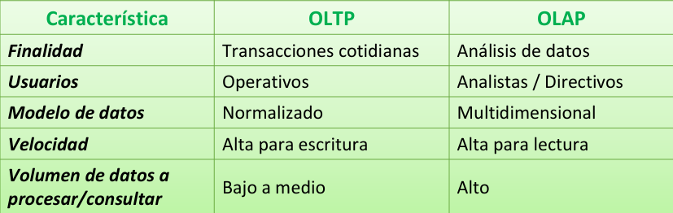

## Data Warehouse

    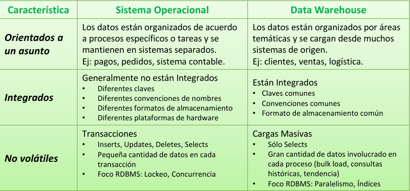

    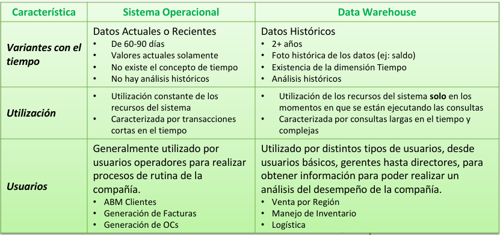

- Un data warehouse es un repositorio central, corporativo, compuesto por datos históricos y actuales. - Son usados por BI para ejecutar consultas analíticas -> se comunican con sistemas OLAP para soportar consultas analíticas
- Periódicamente extraen datos de otras fuentes para consolidarlas en una única base de datos, con lo cual crecen y aumenta el tiempo de respuesta.

    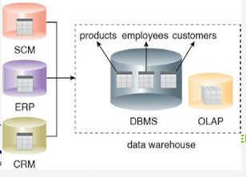

- Los DWs usualmente se implementan en bases de 
datos optimizadas para soportar reporting y tareas de 
análisis de datos
- A veces una base analítica (OLAP) puede existir
 separada de la base de datos. 
- Tuning: índices, vistas materializadas, compresión (antes de las nubes)

## Beneficios de DW + Data Marts

Beneficios del Data warehousing
- Integración de datos históricos
- Mejora en la calidad de la información
- Baselistapara analítica avanzada y BI

**Data Mart:** porción de un DW para análisis de un departamento específico, generalmente no tiene tanto nivel de granularidad como el DW. $\sum datamarts=DWH$

## Enfoques de implementación de DW
Inmon:enfoque descendente (DW corporativo primero)

    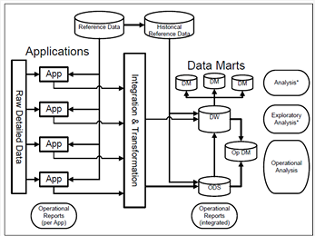

+Lento +Completo

Kimball: enfoque ascendente (Data Marts integrados forman el DW)

    

+Rapido +Retrabajo

## Arquitectura típica de un DW
Puede incluir los siguientes elementos/capas:
- Sistemas fuente, OLTPs
- Staging Area (opcional)
- ETL/ELT
- Repositorio de datos central (**Data Warehouse**)
- Data Marts
- Cubos
- Herramienta de Reporting (reportes, tableros, consultas ad-hoc)
- Data Mining (DDZ)

    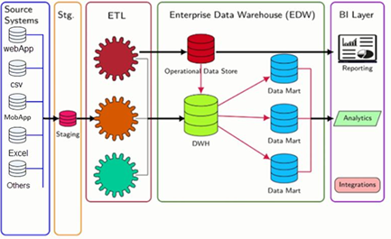

### Ejemplos

**Data Warehouse virtual:**

Para resolver cada pedido de los usuarios, el personal de IT (área de Data) genera distintos procesos/queries para poder extraer la  información de los sistemas operacionales necesarios.

    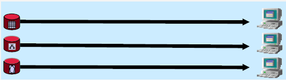

falta de integridad, el excesivo esfuerzo de extracción y de control de la información

**Data Marts independientes**
Se construyen distintos data marts o cubos a medida que se demandan para que puedan resolver los distintos pedidos de los usuarios más rápidamente.

    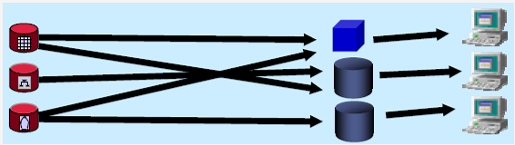

falta de integridad entre los distintos data marts y la duplicidad de los procesos de ETL.

**Data Warehouse**
Se construye un data warehouse completo para que se puedan resolver todos los distintos pedidos analíticos de los usuarios. Luego desde el DW se pueden construir cubos multidimensionales (OLAP) para acceder a la 
información más rápidamente

    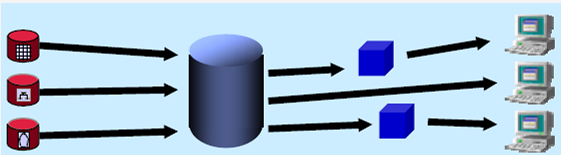

El tiempo que demanda construir el DW suele ser mayor al tiempo que las áreas usuarias están dispuestas a esperar.

## ETL
ETL es la operación principal para cargar los Data wahouse / Data marts

Los datos requeridos primero son obtenidos (extracted) desde las fuentes, y luego de ser extraídos son modificados (transformed) aplicando ciertas reglas,para luego ser insertados (loaded) en el sistema destino

**Herramientas (ADF / AWS Glue)**
- Desarrollar los procesos de ETL en forma visual
- Orquestar la ejecución de los procesos
- Antes se hacia con stored procedures

# Clase 2

## proposito del bi
**definición**: Conjunto de procesos y herramientas orientadas al análisis de información con 
el objetivo de hacer uso de datos reales en el proceso de toma de decisiones
- **alcence estrategico**: informacion confiable para planificación
- **objetivo principal**: datos dispersos -> conocimiento util

**BI como ventaja competitiva:**
- Identificación de tendencias de mercado
- Mejora en la relación con los clientes
- Optimización de procesos internos

| BI operativo | BI estrategico |
|----|-----|
|Reportes diarios, monitoreo de procesos internos| Análisis para visión a largo plazo|

## Arquitectura

### Arquitecturas clasicas vs modernas

**On Premise**(Costos mas altos, Alto control)
- Costos de infra
- Menejo de infra y seguridasd depende de la empresa
- Uso intensivo de recursos
- Local

**Cloud**(Costos mas bajos, Menos control)
- Baja inversion inicial
- Mantenimiento y updates a cargo del provedoor
- Bajo control de infra
- Global y escalable

**Hardware outsourcing**

**Hibridas**

## Big Data
Surge de necesidades de negocio e innovaciones tecnologicas

**definición:**: Volumen masivo de datos variados muy grandes y difíciles de procesar con las 
bases de datos y el software tradicionales.

**Las 5 Vs**:
- Volumen: Muchos datos
- Velocidad: generación y procesamiento rapido
- Variedad: Distintos formatos y tipos
- Veracidad: datos de calidad 
- Valor: datos utiles para la organización.

**Data Lakes:** fepositorio central para almacenar muchos datos crudos en varios formatos
- Pros: Almacenamiento cost-effective, escalabilidad, esquema flexible
- Cons: Desafíos de gobierno de datos, issues de calidad de datos
- **Si es:** gestion de datos flexible, con autoservicio, que soporta whatifs y desechables y promueve la culñtura del retry.
- **No es:** Un reemplazo del DWH o ODS, ni con performance transacional ni analitico.

  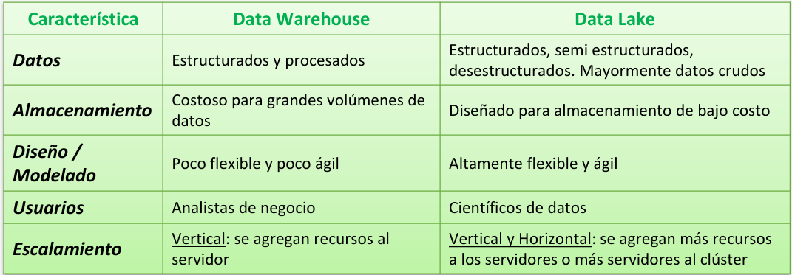
  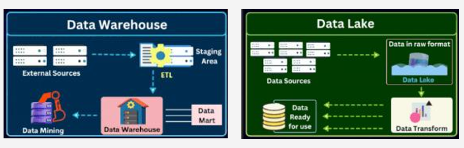

**Usos del data lake**
- Staging: para carga al DWH
- Datos historicos: dado el bajo costo y capacidad para consultas grandes.
- Integración con datos externos: Igual que staging pero con datos externos (suplementing data)

## Asistencia a la toma de decisiones
|Tipos de decisiones |Rol del BI |
|-----|------|
|Estrategicas: largo plazo| definir planes de crecimiento, ROI |
|Tacticas: mediano plazo. ajuste de estrategia|Seguimiento de areas especificas|
|Operativas: dia a dia| monitoreo y optimizacion NRT |

## KPIs

**Métricas:** medidas cuantitativas y cualitativas para cuantificar el rendimiento/progreso
- tomar decisiones informadas
- evaluar efectividad
- establecer objetivos

**KPI(key performance indicator):**  medida del rendimiento de un proceso (%). relacionado con un objetivo 
- Reflejar estado actual y alineación y ajuste con estrategia
- Identificar areas con problemas
- Es importante establecer:
  - Niveles de rendimiento aceptables que sean expuestos por las métricas
  - Método de los informes, la forma, la frecuencia y distribución 

**Tipos de KPI**
- estrategico: cuota de mercado, clientes
- financieros: rentabilidad, utilidad
- tacticos: cantidad de ordenes, clientes satisfechos
- operativos: tiempos de entrega, eficiencia, nivel de servicio

## Objetivos smart (framework)
- Specific: dirigidos al area especifica
- Measurable: datos completos y precisos para medirlos
- Achievable: realistas
- Relevant: medir solo lo necesario para comprender el estado
- Time bound: los resultados deben estar disponibles cuando se necesiten. deben tener marco temporal

## Balanced scorecard
- método para medir el desempeño organizacional de manera integral.
- Herramienta (tableros) que permite convertir misión y visión en KPIs de actuación.
- Perspectivas:
  - Financiera: rentabilidad
  - Clientes: Satisfacción
  - Procesos internos: eficiencia y calidad
  - Aprendizaje y crecimiento: Capacitación, innovación
  - Cultura organizacional

